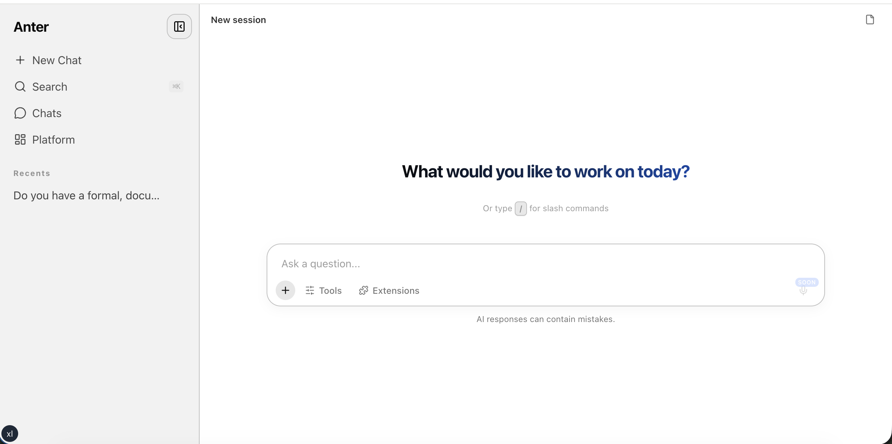
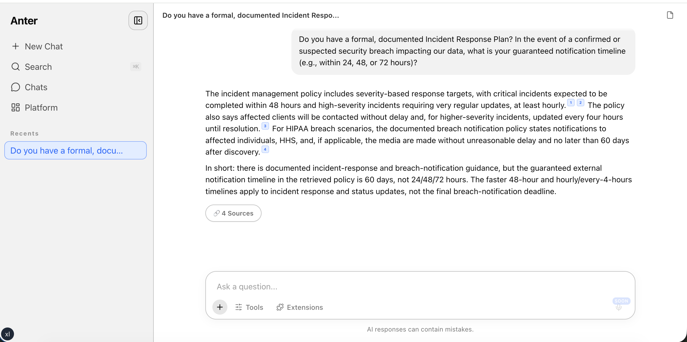
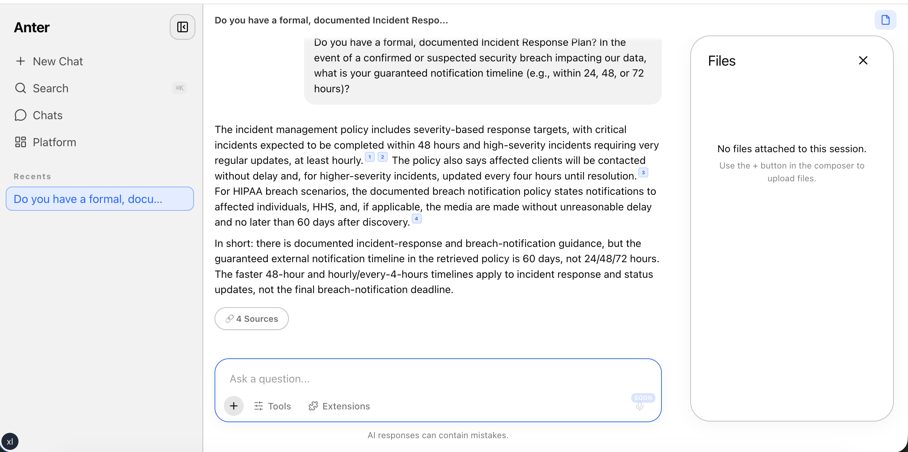

# `@anter/ai-chat-sdk`

An industry-agnostic, embeddable AI chat SDK for React applications. Drop a fully-featured chat UI into any product — regardless of domain — by wiring up your own backend through a simple adapter interface.

---

## Screenshots

|                                                                       Empty state                                                                        |                                               Streaming response with sources                                                |                                          Artifact panel                                          |
| :------------------------------------------------------------------------------------------------------------------------------------------------------: | :--------------------------------------------------------------------------------------------------------------------------: | :----------------------------------------------------------------------------------------------: |
|  |  |  |

---

## Table of contents

- [Overview](#overview)
- [Why this SDK?](#why-this-sdk)
- [Requirements](#requirements)
- [Installation](#installation)
  - [Vendoring before npm publish](#vendoring-before-the-package-is-published-to-npm)
- [Quick start](#quick-start)
- [Components](#components)
  - [ChatProvider](#chatprovider)
  - [ChatShell](#chatshell)
  - [ChatWidget](#chatwidget)
  - [ChatEmptyState](#chatemptystate)
  - [RecordPanel](#recordpanel)
- [The ChatAdapter interface](#the-chatadapter-interface)
- [SSE streaming protocol](#sse-streaming-protocol)
- [Inline content tags](#inline-content-tags)
- [Slash commands](#slash-commands)
- [Command palette (⌘K)](#command-palette-k)
- [Artifact registry](#artifact-registry)
- [Plugins](#plugins)
- [Context variables and `context_required`](#context-variables-and-context_required)
- [Headless hooks](#headless-hooks)
- [Artifacts](#artifacts)
- [Record tags](#record-tags)
- [AskInfosecAdapter (reference implementation)](#askinfosecadapter-reference-implementation)
- [Development](#development)
- [CSS architecture](#css-architecture)
- [TypeScript](#typescript)

---

## Overview

The SDK separates **UI and state** from **backend communication**. You supply an adapter that knows how to talk to your API; the SDK handles streaming, session management, artifact display, slash commands, file uploads, and everything else.

It ships in layered entry points so you can take exactly what you need:

| Import path                             | What you get                                                               |
| --------------------------------------- | -------------------------------------------------------------------------- |
| `@anter/ai-chat-sdk`                    | Everything: UI components + headless hooks + extensions                    |
| `@anter/ai-chat-sdk/ui`                 | UI components only (`ChatShell`, `ChatWidget`, `RecordPanel`, …)           |
| `@anter/ai-chat-sdk/headless`           | Hooks and context only, no UI (`useChat`, `useArtifacts`, `useSources`, …) |
| `@anter/ai-chat-sdk/adapters`           | The built-in `AskInfosecAdapter` reference implementation                  |
| `@anter/ai-chat-sdk/types`              | TypeScript type definitions only                                           |
| `@anter/ai-chat-sdk/styles.css`         | Full stylesheet (includes CSS reset/base)                                  |
| `@anter/ai-chat-sdk/styles-no-base.css` | Stylesheet without base resets                                             |

> **ESM only.** The package is built as ES modules. Configure your bundler accordingly (Vite, Next.js, Webpack 5+, etc. all support this out of the box).

---

## Why this SDK?

- **Domain-free** — no compliance, GRC, or industry-specific language in the core. Works equally for legal, finance, healthcare, customer support, or any other vertical.
- **Adapter-driven** — all backend calls flow through a single `ChatAdapter` interface. Swap backends without touching the UI.
- **SSE streaming** — responses stream token-by-token via Server-Sent Events using `eventsource-parser`.
- **Rich feature set out of the box** — artifacts, sources panel, file uploads, slash commands, ⌘K command palette, model selector, reasoning blocks, follow-up suggestions, inline citations, interactive context chips.
- **Consumer-owned content** — empty states, starter cards, tips, and placeholder text are all supplied by the embedding application. The SDK ships no domain-specific copy.
- **Headless-first** — every UI component is built on top of exported hooks, so you can replace individual surfaces while keeping the rest.

---

## Requirements

| Dependency | Version   |
| ---------- | --------- |
| React      | `^19.0.0` |
| React DOM  | `^19.0.0` |

The SDK treats React as a **peer dependency** — install it yourself in your application.

---

## Installation

This package lives inside the monorepo as a workspace package. From any workspace app:

```bash
pnpm add @anter/ai-chat-sdk
```

For external consumers (once published):

```bash
npm install @anter/ai-chat-sdk
```

### Vendoring before the package is published to npm

If you need to embed the SDK before it appears on the npm registry, copy the `src/` directory into your own monorepo as a local workspace package. The build tooling (`tsup`, `tsc`, CSS copy) is fully standalone — it has no private or internal dependencies.

**Step 1 — copy `src/` into your workspace:**

```bash
# From your monorepo root
mkdir -p packages/ai-chat-sdk
cp -r /path/to/ai-chat-sdk/src packages/ai-chat-sdk/src
```

Copy the build config files alongside it (`tsup.config.ts`, `tsconfig.json`, `tsconfig.build.json`, `jest.config.cjs`, `package.json`, `eslint.config.mjs`). These files contain no private references and work as-is.

**Step 2 — add a workspace reference from your app:**

```json
// your-app/package.json
{
  "dependencies": {
    "@anter/ai-chat-sdk": "workspace:*"
  }
}
```

**Step 3 — add a sync script to pull in upstream changes:**

Create a `sync-upstream.sh` in your local copy. The key rule is: **only sync `src/`** — the config files are yours to own.

```bash
#!/usr/bin/env bash
set -euo pipefail

UPSTREAM="https://github.com/anter-ai/ai-chat-sdk.git"
SCRIPT_DIR="$(cd "$(dirname "${BASH_SOURCE[0]}")" && pwd)"
TEMP=$(mktemp -d)
trap "rm -rf '$TEMP'" EXIT

echo "Cloning upstream..."
git clone --depth 1 "$UPSTREAM" "$TEMP"

echo "Syncing src/..."
rsync -av --delete "$TEMP/src/" "$SCRIPT_DIR/src/"

UPSTREAM_VERSION=$(node -p "require('$TEMP/package.json').version")
echo "Done. Upstream version: $UPSTREAM_VERSION"
echo "Next steps:"
echo "  1. Review: git diff packages/ai-chat-sdk/src"
echo "  2. Rebuild: pnpm --filter @anter/ai-chat-sdk build"
echo "  3. Smoke test: pnpm --filter your-app build"
```

**The invariant to maintain:**

| Path                                                 | Owner          | Rule                                                         |
| ---------------------------------------------------- | -------------- | ------------------------------------------------------------ |
| `src/`                                               | Upstream       | Never edit locally — always contribute back first, then sync |
| `package.json`, `tsconfig.json`, `eslint.config.mjs` | Your workspace | Local adaptations — never overwritten by the sync script     |

To fix a bug or add a feature: open a PR on `anter-ai/ai-chat-sdk`, get it merged, then run `sync-upstream.sh`.

---

## Quick start

### 1. Import styles

Import the stylesheet once at your app's root:

```typescript
import "@anter/ai-chat-sdk/styles.css";
```

If your app already has a CSS reset or base styles, use the no-base variant to avoid double-applying resets:

```typescript
import "@anter/ai-chat-sdk/styles-no-base.css";
```

### 2. Implement a `ChatAdapter`

The adapter bridges the SDK to your backend. Create a class that implements `ChatAdapter`:

```typescript
import type {
  ChatAdapter,
  SessionConfig,
  SessionPatch,
  MessagePayload,
  SessionList,
  SessionWithMessages,
} from "@anter/ai-chat-sdk/types";

class MyAdapter implements ChatAdapter {
  async createSession(config: SessionConfig): Promise<string> {
    const res = await fetch("/api/sessions", {
      method: "POST",
      headers: { "Content-Type": "application/json" },
      body: JSON.stringify({
        contextId: config.contextId,
        model: config.model,
      }),
    });
    const { sessionId } = await res.json();
    return sessionId;
  }

  async loadSession(sessionId: string): Promise<SessionWithMessages> {
    const res = await fetch(`/api/sessions/${sessionId}`);
    return res.json();
  }

  async listSessions(): Promise<SessionList> {
    const res = await fetch("/api/sessions");
    return res.json();
  }

  async updateSession(sessionId: string, patch: SessionPatch): Promise<void> {
    await fetch(`/api/sessions/${sessionId}`, {
      method: "PATCH",
      headers: { "Content-Type": "application/json" },
      body: JSON.stringify(patch),
    });
  }

  async deleteSession(sessionId: string): Promise<void> {
    await fetch(`/api/sessions/${sessionId}`, { method: "DELETE" });
  }

  async sendMessage(payload: MessagePayload): Promise<ReadableStream<Uint8Array>> {
    const res = await fetch("/api/chat/stream", {
      method: "POST",
      headers: {
        "Content-Type": "application/json",
        Accept: "text/event-stream",
      },
      body: JSON.stringify(payload),
    });
    if (!res.body) throw new Error("Missing response body");
    return res.body;
  }
}
```

### 3. Wrap with `ChatProvider`

```tsx
import { ChatProvider } from "@anter/ai-chat-sdk";
import { MyAdapter } from "./my-adapter";

const adapter = new MyAdapter();

export function App() {
  return (
    <ChatProvider
      organizationId="org-123"
      adapter={adapter}
      config={{
        enableArtifacts: true,
        enableSlashCommands: true,
        theme: "system",
      }}
    >
      <YourApp />
    </ChatProvider>
  );
}
```

### 4. Render a chat surface

**Full-page chat shell:**

```tsx
import { ChatShell } from "@anter/ai-chat-sdk";

export function ChatPage() {
  return <ChatShell />;
}
```

**Floating corner widget:**

```tsx
import { ChatWidget } from "@anter/ai-chat-sdk";
import { useRouter } from "next/navigation";

export function FloatingChat() {
  const router = useRouter();
  return (
    <ChatWidget
      position="bottom-right"
      fullChatUrl={(sessionId) => `/chat${sessionId ? `/${sessionId}` : ""}`}
      onNavigate={(url) => router.push(url)}
    />
  );
}
```

---

## Components

### `<ChatProvider>`

The root context provider. Must wrap all other SDK components.

```tsx
<ChatProvider
  organizationId="org-123"
  adapter={adapter}
  config={{ ... }}
  strings={{ ... }}
>
  {children}
</ChatProvider>
```

| Prop             | Type                   | Required | Description                                           |
| ---------------- | ---------------------- | -------- | ----------------------------------------------------- |
| `organizationId` | `string`               | Yes      | Tenant identifier passed to the adapter on every call |
| `adapter`        | `ChatAdapter`          | Yes      | Your adapter instance                                 |
| `config`         | `ChatConfig`           | No       | Feature flags and UI defaults (see below)             |
| `strings`        | `Partial<ChatStrings>` | No       | Override any UI copy (see below)                      |

> **`organizationId` when there is no per-org routing:** If your application does not have per-tenant URLs (e.g. a platform admin console, a single-tenant deployment, or a white-label product with no org scoping), pass any stable string that your backend will recognise — the value is forwarded to your adapter on every call and is otherwise opaque to the SDK. Common choices are `"default"`, your product slug, or an internal platform identifier.
>
> ```tsx
> // Multi-tenant — org is in the URL
> <ChatProvider organizationId={params.orgId} adapter={adapter}>
>
> // Single-tenant or admin context — use a stable constant
> <ChatProvider organizationId="platform-admin" adapter={adapter}>
> ```

**`config` options:**

| Option                     | Type                            | Default               | Description                                                       |
| -------------------------- | ------------------------------- | --------------------- | ----------------------------------------------------------------- |
| `enableArtifacts`          | `boolean`                       | `true`                | Show the artifact panel when the AI generates a document          |
| `enableModelSelector`      | `boolean`                       | `true`                | Show a model picker in the composer toolbar                       |
| `enableFileUpload`         | `boolean`                       | `false`               | Allow users to attach files to messages                           |
| `enableSlashCommands`      | `boolean`                       | `true`                | Show the `/` slash command menu                                   |
| `enableCommandPalette`     | `boolean`                       | `true`                | Enable the ⌘K command palette                                     |
| `enableSlashFocusShortcut` | `boolean`                       | `true`                | Focus the composer when the user presses `/` anywhere on the page |
| `defaultModel`             | `string`                        | `"claude-sonnet-4-6"` | Pre-selected model in the model picker                            |
| `theme`                    | `"light" \| "dark" \| "system"` | `"system"`            | Color theme applied via `data-theme` attribute                    |

**`strings` overrides** — all keys optional, defaults shown:

| Key                   | Default                                |
| --------------------- | -------------------------------------- |
| `composerPlaceholder` | `"Ask a question..."`                  |
| `footerDisclaimer`    | `"AI responses can contain mistakes."` |
| `newConversation`     | `"New conversation"`                   |
| `sendMessage`         | `"Send message"`                       |
| `retry`               | `"Retry"`                              |
| `thinking`            | `"Thinking..."`                        |
| `exportArtifact`      | `"Save to workspace"`                  |
| `exportArtifactSub`   | `"Attach to your workspace"`           |
| `openFullChat`        | `"Open full chat"`                     |
| `cancel`              | `"Cancel"`                             |
| `artifactPanelClose`  | `"Close artifact panel"`               |

---

### `<ChatShell>`

A full-page chat interface with a collapsible sidebar, resizable panels for sources/files/artifacts, conversation history, and a command palette.

```tsx
<ChatShell
  emptyState={<MyEmptyState />}
  tips={[
    {
      id: "tip-1",
      type: "info",
      title: "Press / for slash commands",
      dismissible: true,
    },
  ]}
  initialSessionId="session-abc"
  onSessionChange={(id) => router.replace(`/chat/${id ?? ""}`)}
  onExportArtifact={async (artifactId) => {
    await myApi.save(artifactId);
  }}
  onRecordClick={({ subject, subjectId }) => router.push(`/records/${subject}/${subjectId}`)}
  recordPanel={<MyRecordPanel />}
  className="my-shell"
/>
```

| Prop               | Type                                    | Description                                                                                           |
| ------------------ | --------------------------------------- | ----------------------------------------------------------------------------------------------------- |
| `emptyState`       | `React.ReactNode`                       | Rendered when there are no messages. Defaults to `<ChatEmptyState />`                                 |
| `tips`             | `ComposerAnnouncement[]`                | Tip banners shown randomly in the composer on mount                                                   |
| `initialSessionId` | `string`                                | Session to load on mount. Triggers `adapter.loadSession`                                              |
| `onSessionChange`  | `(id?: string) => void`                 | Fires whenever the active session changes (new or cleared)                                            |
| `onExportArtifact` | `(artifactId: string) => Promise<void>` | Artifact export callback. When omitted, the export button is hidden                                   |
| `onRecordClick`    | `(record: RecordTag) => void`           | Called when the user clicks an inline record chip                                                     |
| `recordPanel`      | `React.ReactNode`                       | Custom panel content rendered in the right resizable pane (replaces the artifact panel when provided) |
| `className`        | `string`                                | Additional CSS class on the shell root element                                                        |

> **Height requirement:** `ChatShell` manages its own internal scroll and resizable panel layout. It must be rendered inside a container with an explicit, bounded height — a flex parent with `flex: 1` or `height: 100%`. Without a bounded height the resizable panels have nothing to fill and will collapse.
>
> ```tsx
> // ✅ Correct — parent provides explicit height
> <div style={{ height: "100%", display: "flex", flexDirection: "column" }}>
>   <ChatShell />
> </div>
>
> // ✅ Also correct — flex child expanding to fill available space
> <main style={{ flex: 1, display: "flex", flexDirection: "column", overflow: "hidden" }}>
>   <ChatShell />
> </main>
>
> // ❌ Incorrect — no bounded height, panels collapse
> <div>
>   <ChatShell />
> </div>
> ```
>
> If you are embedding `ChatShell` inside a page layout that already provides a scrollable `overflow-y: auto` container, wrap it with `overflow: hidden` on the parent so `ChatShell`'s internal scroll takes over from the page scroll.

**`ComposerAnnouncement` shape:**

```typescript
interface ComposerAnnouncement {
  id: string;
  type: "info" | "warning" | "success" | "announcement";
  title: string;
  icon?: string; // Optional emoji or short icon label
  dismissible?: boolean; // Adds a dismiss button to the banner
  onDismiss?: () => void; // Called when the user dismisses the banner
}
```

---

### `<ChatWidget>`

A floating popover widget anchored to a corner of the screen. Uses a Radix UI `Popover` internally.

```tsx
<ChatWidget
  position="bottom-right"
  initialOpen={false}
  fullChatUrl={(sessionId) => `/chat/${sessionId ?? ""}`}
  onNavigate={(url) => router.push(url)}
  title="AI Assistant"
  subtitle="Powered by your platform"
  emptyState={<MyWelcomeScreen />}
  onExportArtifact={async (id) => {
    await myApi.save(id);
  }}
/>
```

| Prop               | Type                                    | Default                      | Description                                                                          |
| ------------------ | --------------------------------------- | ---------------------------- | ------------------------------------------------------------------------------------ |
| `position`         | `"bottom-right" \| "bottom-left"`       | `"bottom-right"`             | Corner to anchor the widget trigger button                                           |
| `initialOpen`      | `boolean`                               | `false`                      | Whether the popover opens on mount                                                   |
| `fullChatUrl`      | `(sessionId: string \| null) => string` | —                            | Builds the URL for "Open full chat". `sessionId` is `null` when no session is active |
| `onNavigate`       | `(url: string) => void`                 | —                            | Navigation callback. Pass your router's push function here                           |
| `title`            | `string`                                | `orgLabel ?? "AI Assistant"` | Header title. Falls back to `orgLabel` set by the adapter, then `"AI Assistant"`     |
| `subtitle`         | `string`                                | —                            | Optional header subtitle line                                                        |
| `emptyState`       | `React.ReactNode`                       | —                            | Content shown before the first message                                               |
| `onExportArtifact` | `(artifactId: string) => Promise<void>` | —                            | Artifact export callback; hides export button when omitted                           |

---

### `<ChatEmptyState>`

The default empty state shown when no messages exist. Pass it via `emptyState` on `ChatShell` / `ChatWidget`, or render it standalone in a custom shell.

```tsx
import { ChatEmptyState, type StarterCard } from "@anter/ai-chat-sdk";
import { Shield, FileSearch } from "lucide-react";

const STARTER_CARDS: StarterCard[] = [
  {
    icon: <Shield size={18} />,
    iconColor: "#6366f1",
    title: "Security review",
    description: "Analyze a document for risks",
    prompt: "Please review this document for security risks.",
  },
  {
    icon: <FileSearch size={18} />,
    iconColor: "#0ea5e9",
    title: "Summarize a policy",
    description: "Get a plain-language summary",
    prompt: "Summarize this policy in plain language.",
  },
];

<ChatEmptyState
  heading="What can I help you with?"
  subheading="Powered by your AI platform"
  starterCards={STARTER_CARDS}
  onSendMessage={(prompt) => sendMessage(prompt)}
/>;
```

| Prop            | Type                        | Default                                   | Description                                   |
| --------------- | --------------------------- | ----------------------------------------- | --------------------------------------------- |
| `heading`       | `string`                    | `"What would you like to work on today?"` | Main heading (rendered with a gradient style) |
| `subheading`    | `string`                    | —                                         | Optional secondary line below the heading     |
| `starterCards`  | `StarterCard[]`             | `[]`                                      | Grid of clickable prompt suggestion cards     |
| `onSendMessage` | `(message: string) => void` | —                                         | Called with the card's `prompt` when clicked  |

**`StarterCard` shape:**

```typescript
interface StarterCard {
  icon: React.ReactNode; // Any React element — typically a Lucide icon
  iconColor: string; // CSS color used for the icon and its background tint
  title: string;
  description: string;
  prompt: string; // The message sent when the card is clicked
}
```

---

### `<RecordPanel>`

An iframe-based side panel for displaying an external record alongside the chat. Pass it to `ChatShell` via the `recordPanel` prop to replace the artifact panel.

```tsx
import { RecordPanel } from "@anter/ai-chat-sdk";

function MyShell() {
  const [activeRecord, setActiveRecord] = useState(null);

  return (
    <ChatShell
      onRecordClick={(record) => setActiveRecord(record)}
      recordPanel={
        activeRecord ? (
          <RecordPanel
            subject={activeRecord.subject}
            iframeSrc={`/records/${activeRecord.subjectId}/embed`}
            externalHref={`/records/${activeRecord.subjectId}`}
            onClose={() => setActiveRecord(null)}
          />
        ) : undefined
      }
    />
  );
}
```

| Prop           | Type         | Description                                                                     |
| -------------- | ------------ | ------------------------------------------------------------------------------- |
| `subject`      | `string`     | Display label for the panel header (kebab-case is auto-formatted to Title Case) |
| `iframeSrc`    | `string`     | URL of the page to embed in the iframe                                          |
| `externalHref` | `string`     | Optional "Open in new tab" link shown in the header                             |
| `onClose`      | `() => void` | Called when the user closes the panel (or presses Escape)                       |

The iframe uses `sandbox="allow-scripts allow-same-origin allow-popups"`.

---

## The `ChatAdapter` Interface

All backend communication flows through one interface. Implement it to connect any backend.

```typescript
interface ChatAdapter {
  // Required
  createSession(config: SessionConfig): Promise<string>;
  loadSession(sessionId: string): Promise<SessionWithMessages>;
  listSessions(params?: ListParams): Promise<SessionList>;
  updateSession(sessionId: string, patch: SessionPatch): Promise<void>;
  deleteSession(sessionId: string): Promise<void>;
  sendMessage(payload: MessagePayload): Promise<ReadableStream<Uint8Array>>;

  // Optional
  loadSlashCommands?(): Promise<void>;
  uploadFile?(
    sessionId: string,
    file: File,
    options?: UploadFileOptions,
  ): Promise<ChatSessionFileRef>;
  listSessionFiles?(sessionId: string): Promise<ChatSessionFileRef[]>;
  deleteSessionFile?(sessionId: string, fileId: string): Promise<void>;
}
```

**Method details:**

| Method              | Notes                                                                                                                             |
| ------------------- | --------------------------------------------------------------------------------------------------------------------------------- |
| `createSession`     | Return a session ID string. Creating the session in the backend is optional — the ID just needs to be stable for subsequent calls |
| `loadSession`       | Return the full `SessionWithMessages` shape including all messages and any artifacts                                              |
| `listSessions`      | Return a paginated `SessionList`. The SDK passes `{ page: 1, limit: 50 }` by default                                              |
| `sendMessage`       | Must return a `ReadableStream<Uint8Array>` of SSE text. See [SSE Streaming Protocol](#sse-streaming-protocol)                     |
| `loadSlashCommands` | Called once on `ChatStateProvider` mount. Use it to fetch and register slash commands                                             |
| `uploadFile`        | Required when `enableFileUpload: true`. File upload is disabled at the UI level if this method is absent                          |
| `listSessionFiles`  | Called when the files panel opens or the session changes                                                                          |
| `deleteSessionFile` | Called when the user removes a file from the session                                                                              |

**`SessionConfig` shape:**

```typescript
interface SessionConfig {
  organizationId: string;
  contextId?: string; // The active context ID at the time the session is created
  model?: string;
  title?: string;
}
```

**`MessagePayload` shape:**

```typescript
interface MessagePayload {
  organizationId: string;
  sessionId: string;
  message: string;
  attachedFileIds?: string[];
  contextVariables?: Record<string, string>;
  // contextVariables may include:
  //   contextId     — set when setActiveContext() has been called
  //   slashCommand  — the slashCommandId of a matched slash command
  //   sessionId     — always included
  //   ...plus any extraContextVariables passed by the host app
}
```

---

## SSE Streaming Protocol

`sendMessage` must return a `ReadableStream<Uint8Array>` carrying Server-Sent Events. The SDK parses them using `eventsource-parser`.

### Event format

Each event follows the SSE wire format:

```
event: content
data: {"content":"Hello, "}

event: content
data: {"content":"world!"}

event: done
data: {"isComplete":true}
```

The SDK also accepts events where the type is embedded in the JSON payload (not the `event:` line):

```
data: {"event":"content","content":"Hello"}
data: {"type":"done","isComplete":true}
data: {"payload":{"event":"step","...":"..."}}
```

All three patterns are resolved by `resolveEventType` — you can use whichever format your backend produces.

The `[DONE]` sentinel (used by some OpenAI-compatible APIs) is also handled:

```
data: [DONE]
```

### Supported event types

| Event              | Expected payload                                                                                  | Description                                                                                                                                          |
| ------------------ | ------------------------------------------------------------------------------------------------- | ---------------------------------------------------------------------------------------------------------------------------------------------------- |
| `content`          | `{ content: string }` or `{ payload: { text: string } }`                                          | A streamed text chunk — appended to the current message                                                                                              |
| `done`             | `{ isComplete: true, artifactIds?: string[], suggestions?: string[], sources?: MessageSource[] }` | Stream complete — triggers post-processing (citations, record tags, suggestions)                                                                     |
| `error`            | `{ error: string }`                                                                               | Fatal error — shown in the message bubble with a Retry button                                                                                        |
| `artifact`         | `{ payload: Artifact }`                                                                           | A server-generated artifact to store and show in the artifact panel                                                                                  |
| `step`             | `{ step: AgentStepEvent }`                                                                        | An agent reasoning or tool step (rendered in the collapsible step timeline above the message)                                                        |
| `plan`             | `{ plan: { phases: AgentPlanPhase[] } }`                                                          | Agent plan phases displayed above the message while streaming                                                                                        |
| `context_required` | `{ payload: { contextKey, questionIntro, choices[] } }`                                           | Pauses the conversation and renders interactive choice chips (see [Context variables and context_required](#context-variables-and-context_required)) |
| `context_resolved` | `{ payload: { key: "contextId", value: string } }`                                                | Server resolved a required context value — updates `activeContextId` in the provider                                                                 |

### Minimal streaming server example (Node.js / Bun)

```typescript
// In your API route handler:
export async function POST(req: Request) {
  const body = await req.json();
  const stream = new ReadableStream({
    async start(controller) {
      const enc = new TextEncoder();
      const send = (event: string, data: object) =>
        controller.enqueue(enc.encode(`event: ${event}\ndata: ${JSON.stringify(data)}\n\n`));

      send("content", { content: "Hello, " });
      send("content", { content: "world!" });
      send("done", { isComplete: true });
      controller.close();
    },
  });

  return new Response(stream, {
    headers: {
      "Content-Type": "text/event-stream",
      "Cache-Control": "no-cache",
    },
  });
}
```

### Agent step events

When the `step` event is sent, the SDK accumulates steps into a collapsible **ReasoningBlock** rendered above the message content. This lets you expose agent tool calls, retrieval steps, and internal reasoning without cluttering the main message text.

```typescript
interface AgentStepEvent {
  type: "reasoning" | "tool_call" | "tool_result" | "handoff" | "retrieval";
  label: string;
  detail?: string;
  status: "in_progress" | "done" | "error";
  step_id: string;
  duration_ms?: number;
  tokens_used?: number;
}
```

---

## Inline content tags

The SDK parses several custom XML-like tags that can appear in streamed assistant content. These are stripped from the rendered markdown and converted to structured UI elements.

### `<artifact>` — inline artifact extraction

An `<artifact>` tag in message content creates an artifact without needing a separate SSE `artifact` event. This is the fallback path when the backend embeds content directly in the text stream.

```
<artifact type="markdown" title="Security Policy">
# Information Security Policy
...
</artifact>
```

Attributes:

| Attribute | Description                                                              |
| --------- | ------------------------------------------------------------------------ |
| `type`    | Artifact type: `markdown`, `html`, `code`, `table`, or any custom string |
| `title`   | Display title in the artifact panel header                               |

The tag is stripped from the rendered message and the artifact appears as a chip below the message bubble.

### `<cite>` — inline citations

Citation tags are stripped and replaced with clickable `[N]` superscript markers. Clicking a marker opens the sources panel scrolled to that source.

```
The policy requires annual reviews<cite source_id="doc-001">annual reviews</cite>.
```

The `source_id` must match an `id` in the `sources` array on the `done` event. Up to 10 citations are supported; unresolvable IDs are silently dropped.

### `<record>` — inline record references

Record tags are stripped and rendered as clickable chips below the message bubble. Multiple IDs can be comma-separated in `subjectId`.

```
See the related control<record subject="control" subjectId="ctrl-101,ctrl-102" />.
```

### `<suggestions>` — follow-up suggestions

A JSON array of suggested follow-up questions, stripped from the content and rendered as clickable chips below the message.

```
<suggestions>["What are the next steps?", "Show me the related policies"]</suggestions>
```

On the happy path, the backend strips this tag before sending content to the client. The SDK also handles the fallback case where it arrives as raw text.

---

## Slash commands

The slash command registry is a module-level singleton — register commands once and they appear in the `/` menu for all SDK instances on the page.

```typescript
import { registerSlashCommand, getSlashCommandRegistry } from "@anter/ai-chat-sdk";

registerSlashCommand({
  name: "/analyze",
  description: "Run a deep analysis on your document",
  slashCommandId: "analyze",
  exampleUsage: "/analyze my-document.pdf",
  onSelect: ({ setValue, submit }) => {
    setValue("/analyze ");
    // Don't call submit() here if you want the user to type additional arguments
  },
});
```

**`RegisteredSlashCommand` shape:**

```typescript
interface RegisteredSlashCommand {
  name: string; // Must start with /
  description: string;
  slashCommandId: string;
  exampleUsage?: string;
  onSelect: (api: { setValue: (v: string) => void; submit: (v?: string) => void }) => void;
}
```

The built-in `/help` command is always present. It renders a table of all registered commands inline without calling the backend.

`registerSlashCommand` is idempotent — registering a command whose `name` already exists is a no-op.

**Loading commands from an API** — implement `loadSlashCommands()` on your adapter:

```typescript
async loadSlashCommands(): Promise<void> {
  const res = await fetch('/api/commands');
  const commands = await res.json();
  commands.forEach((cmd) =>
    registerSlashCommand({
      name: cmd.name,
      description: cmd.description,
      slashCommandId: cmd.id,
      exampleUsage: cmd.exampleUsage,
      onSelect: ({ setValue, submit }) => { setValue(cmd.name); submit(cmd.name); },
    }),
  );
}
```

---

## Command palette (⌘K)

The command palette surfaces arbitrary actions registered with `registerCommand`. Register inside a React component and clean up on unmount.

```typescript
import { registerCommand, unregisterCommand } from "@anter/ai-chat-sdk";
import { useEffect } from "react";

function MyFeature({ onExport }: { onExport: () => void }) {
  useEffect(() => {
    registerCommand({
      id: "myapp:export",
      label: "Export current session",
      description: "Download the conversation as Markdown",
      onExecute: onExport,
    });
    return () => unregisterCommand("myapp:export");
  }, [onExport]);
}
```

**`RegisteredCommand` shape:**

```typescript
interface RegisteredCommand {
  id: string; // Stable, unique — use a namespaced prefix (e.g. 'myapp:')
  label: string; // Primary text in the palette list
  description?: string; // Secondary text shown below the label
  onExecute: () => void;
}
```

Re-registering with the same `id` replaces the existing entry in-place (safe for React Strict Mode double-mounts).

The SDK registers two built-in commands under the `shell:` namespace:

- `shell:new-conversation` — clears messages and starts a fresh session
- `shell:view-recents` — opens the conversation history view

Use a different prefix (e.g. `myapp:`, `plugin:`, `host:`) to avoid conflicts.

---

## Artifact registry

Register custom renderers for non-standard artifact types. The registry maps artifact type strings to render functions.

```typescript
import { registerArtifact } from '@anter/ai-chat-sdk';

registerArtifact('mermaid', {
  detect: (content) => content.trim().startsWith('graph') || content.trim().startsWith('sequenceDiagram'),
  render: (content) => <MermaidDiagram source={content} />,
  exportFormats: ['svg', 'png'],
});
```

**`ArtifactRendererConfig` shape:**

```typescript
interface ArtifactRendererConfig {
  detect: (content: string) => boolean; // Returns true if this renderer handles the content
  render: (content: string) => ReactNode;
  exportFormats?: string[]; // Shown as download options in the artifact panel
}
```

Built-in renderers handle `markdown`, `html`, `code`, `table`, and `docx`. Custom registrations are checked first when the artifact type matches.

---

## Plugins

Plugins let the host application inject React UI into named **slots** inside the SDK's surfaces — without requiring the SDK to know anything about the domain content being injected. The SDK defines _where_ slots exist; the host supplies _what_ renders in them.

Plugins are passed as the `plugins` prop on `<ChatProvider>` and are available throughout the SDK tree via `useChatContext()`.

```typescript
import type { ChatPlugins } from "@anter/ai-chat-sdk";
```

### Available slots

| Slot              | Location                                | Description                                       |
| ----------------- | --------------------------------------- | ------------------------------------------------- |
| `composerActions` | Composer footer, after the Tools button | Additional action buttons in the composer toolbar |

### Injecting a composer action

Pass any React node as `composerActions`. Use the `ais-composer-footer-btn` CSS class if you want your button to match the built-in Tools button style.

```tsx
import { ChatProvider } from "@anter/ai-chat-sdk";

function MyApp() {
  return (
    <ChatProvider
      adapter={adapter}
      organizationId={organizationId}
      plugins={{
        composerActions: <MyExtensionsButton />,
      }}
    >
      <ChatShell />
    </ChatProvider>
  );
}
```

The button renders in the composer footer left group, to the right of the built-in Tools button:

```
[ + ]  [ Tools ]  [ MyExtensionsButton ]          [ 🎤 ]
```

### Persistent context variables

When a plugin needs to inject state into every message send — for example, a toggle that changes the backend's behaviour — use `setPersistentContextVariable` from `useChatContext()`.

Persistent variables are merged into `payload.contextVariables` on every `sendMessage` call. They sit at the lowest priority: `activeContextId`, `slashCommand`, and per-message `extraContextVariables` all override them if the same key is used.

```
persistentContextVariables   (lowest — background state)
  ↓ overridden by
activeContextId              (framework/context selection)
  ↓ overridden by
slashCommand                 (matched slash command id)
  ↓ overridden by
extraContextVariables        (highest — explicit per-message overrides)
```

```tsx
// Inside any component that is a descendant of ChatProvider
import { useChatContext } from "@anter/ai-chat-sdk";

function MyToggle() {
  const { setPersistentContextVariable } = useChatContext();
  const [enabled, setEnabled] = useState(false);

  const toggle = () => {
    const next = !enabled;
    setEnabled(next);
    // Pass undefined to clear the key from contextVariables
    setPersistentContextVariable("myMode", next ? "true" : undefined);
  };

  return <button onClick={toggle}>{enabled ? "Disable" : "Enable"} My Mode</button>;
}
```

### Full example — Extensions menu

Here is a complete host-application plugin that adds an Extensions dropdown to the composer with two items: a persistent mode toggle and an import action.

```tsx
// host-app/extensions-menu.tsx
"use client";

import { useState } from "react";
import { useChatContext } from "@anter/ai-chat-sdk";

interface ExtensionsMenuProps {
  onImportQuestionnaire?: () => void;
}

export function ExtensionsMenu({ onImportQuestionnaire }: ExtensionsMenuProps) {
  const { setPersistentContextVariable } = useChatContext();
  const [rfpModeEnabled, setRfpModeEnabled] = useState(false);

  const toggleRfpMode = () => {
    const next = !rfpModeEnabled;
    setRfpModeEnabled(next);
    setPersistentContextVariable("rfpMode", next ? "true" : undefined);
  };

  return (
    <div className="extensions-dropdown">
      <button type="button" className="ais-composer-footer-btn">
        Extensions
      </button>
      {/* your dropdown implementation */}
      <ul>
        <li>
          <button type="button" onClick={toggleRfpMode}>
            RFP Mode — {rfpModeEnabled ? "On" : "Off"}
          </button>
        </li>
        {onImportQuestionnaire && (
          <li>
            <button type="button" onClick={onImportQuestionnaire}>
              Import questionnaire
            </button>
          </li>
        )}
      </ul>
    </div>
  );
}
```

```tsx
// host-app/chat-wrapper.tsx
import { ChatProvider, ChatShell } from "@anter/ai-chat-sdk";
import { ExtensionsMenu } from "./extensions-menu";

export function ChatWrapper({ organizationId, onImportQuestionnaire }) {
  return (
    <ChatProvider
      adapter={adapter}
      organizationId={organizationId}
      plugins={{
        composerActions: <ExtensionsMenu onImportQuestionnaire={onImportQuestionnaire} />,
      }}
    >
      <ChatShell />
    </ChatProvider>
  );
}
```

When the user enables RFP Mode and sends a message, the adapter receives:

```typescript
payload.contextVariables ===
  {
    rfpMode: "true", // from setPersistentContextVariable
    contextId: "proj-123", // from setActiveContext (if set)
  };
```

When toggled off, `rfpMode` is cleared from `contextVariables` automatically.

### Adding more slots

`ChatPlugins` is a typed interface — adding a slot means adding a field to it. If you need a slot that doesn't exist yet, open a PR against the SDK rather than working around it; slots must be position-descriptive and domain-agnostic (e.g. `headerActions`, `emptyStateFooter`) to preserve the agnostic contract.

---

## Context variables and `context_required`

### Sending context variables

Context variables are arbitrary key-value pairs merged into `payload.contextVariables` on every `sendMessage` call. There are three sources:

- **Persistent** — set via `setPersistentContextVariable` (see [Plugins](#plugins)); merged first, lowest priority
- **Automatic** — `contextId` (from `setActiveContext`) and `slashCommand` (matched command id)
- **Per-message** — passed as the 4th argument to `sendMessage`; highest priority, overrides all others

Your adapter receives the merged result in `payload.contextVariables`. To pass additional variables for a single message from any component:

```typescript
const { sendMessage } = useChat();

// Pass extra context variables alongside the message
sendMessage("Analyze this contract", undefined, undefined, {
  documentId: "doc-abc",
  mode: "strict",
});
```

### Setting the active context

```tsx
import { useChatContext } from "@anter/ai-chat-sdk/headless";

function ProjectPicker({ projects }) {
  const { setActiveContext, activeContextId, activeContextLabel } = useChatContext();

  return (
    <select
      value={activeContextId ?? ""}
      onChange={(e) => {
        const project = projects.find((p) => p.id === e.target.value);
        setActiveContext(project?.id, project?.name);
      }}
    >
      {projects.map((p) => (
        <option key={p.id} value={p.id}>
          {p.name}
        </option>
      ))}
    </select>
  );
}
```

The `activeContextLabel` (second argument to `setActiveContext`) is displayed as a tag in the composer. The `activeContextId` is sent to the backend as `contextVariables.contextId`.

### `context_required` — interactive choice chips

When the backend cannot proceed without a required value, it emits a `context_required` SSE event instead of streaming a response. The SDK renders the `questionIntro` as the assistant's message and displays the `choices` as interactive button chips.

```typescript
// Backend sends:
{
  event: 'context_required',
  payload: {
    contextKey: 'projectId',
    questionIntro: 'Which project would you like to analyze?',
    choices: [
      { label: 'Project Alpha', value: 'proj-001' },
      { label: 'Project Beta',  value: 'proj-002' },
    ],
  },
}
```

When the user clicks a chip, the SDK sends the `label` as the next user message. The backend can then respond with a `context_resolved` event to update the active context, or simply continue the conversation.

---

## Headless hooks

Use the headless layer to build fully custom UIs while keeping all state management.

### Setup

Both `ChatProvider` (config + adapter) and `ChatStateProvider` (conversation state) must be in the tree. `ChatStateProvider` is the inner provider that owns message state — `ChatShell` and `ChatWidget` create it for you, but headless usage requires it explicitly.

```tsx
import { ChatProvider } from "@anter/ai-chat-sdk";
import { ChatStateProvider, useChat } from "@anter/ai-chat-sdk/headless";

function MyCustomChat() {
  return (
    <ChatProvider organizationId="org-123" adapter={adapter}>
      <ChatStateProvider>
        <MyCustomChatInner />
      </ChatStateProvider>
    </ChatProvider>
  );
}

function MyCustomChatInner() {
  const { messages, sendMessage, isStreaming, clearMessages } = useChat();
  return (
    <div>
      {messages.map((m) => (
        <p key={m.id}>{m.content}</p>
      ))}
      <button onClick={() => sendMessage("Hello")} disabled={isStreaming}>
        Send
      </button>
    </div>
  );
}
```

### Available hooks

#### `useChat()`

The primary chat state hook. Must be used inside `ChatStateProvider`.

```typescript
interface UseChatReturn {
  messages: ChatMessage[];
  streamingState: StreamingState;
  isStreaming: boolean; // Shorthand for streamingState.isStreaming
  isLoading: boolean; // True while waiting for the first chunk
  error?: string;
  currentSessionId?: string;
  currentSessionTitle?: string;
  adapter: ChatAdapter;
  sendMessage: (
    message: string,
    attachedFileIds?: string[],
    overrideSessionId?: string,
    extraContextVariables?: Record<string, string>,
  ) => Promise<void>;
  clearMessages: () => void; // Resets to a new conversation
  retryLastMessage: () => Promise<void>;
  loadSession: (session: SessionWithMessages) => void;
}
```

#### `useArtifacts()`

```typescript
interface UseArtifactsReturn {
  artifacts: Map<string, Artifact>;
  panelState: ArtifactPanelState;
  activeArtifact?: Artifact;
  openArtifact: (artifactId: string) => void;
  closePanel: () => void;
  setActiveTab: (tab: "preview" | "source" | "export") => void;
  registerArtifacts: (artifacts: Artifact[]) => void;
  markSaved: (artifactId: string, record: LinkedRecord) => void;
}
```

#### `useSources()`

```typescript
interface UseSourcesReturn {
  activeSources: MessageSource[];
  activeMessageId?: string;
  panelState: SourcesPanelState;
  openSources: (messageId: string, sources: MessageSource[], scrollToIndex?: number) => void;
  closeSources: () => void;
}
```

#### `useSessionFiles()`

Only meaningful when `enableFileUpload: true` and the adapter implements `listSessionFiles`.

```typescript
interface UseSessionFilesReturn {
  files: ChatSessionFileRef[];
  isLoading: boolean;
  panelOpen: boolean;
  openPanel: () => void;
  closePanel: () => void;
  refresh: () => Promise<void>;
  deleteFile: (fileId: string) => Promise<void>;
}
```

#### `useConversationHistory()`

Fetches the session list from the adapter and provides refresh/delete.

```typescript
// Returns:
{
  sessions: Session[];
  isLoading: boolean;
  refresh: () => Promise<void>;
  deleteSession: (sessionId: string) => Promise<void>;
}
```

#### `useChatContext()`

Direct access to the provider's shared state.

```typescript
// Key fields:
{
  adapter: ChatAdapter;
  organizationId: string;
  config: Required<ChatConfig>;
  strings: ChatStrings;
  plugins: ChatPlugins;
  currentSession?: Session;
  activeContextId?: string;
  activeContextLabel?: string;
  setActiveContext: (id: string | undefined, label?: string) => void;
  announcement: ComposerAnnouncement | null;
  setAnnouncement: (a: ComposerAnnouncement | null) => void;
  persistentContextVariables: Record<string, string>;
  setPersistentContextVariable: (key: string, value: string | undefined) => void;
}
```

#### `useStickyBottom()`

Utility hook that keeps a scrollable container pinned to the bottom as new content arrives. Returns a ref to attach to the scroll container.

### Message roles

`ChatMessage.role` can be:

| Role          | Rendered as                                                                                                                               |
| ------------- | ----------------------------------------------------------------------------------------------------------------------------------------- |
| `"user"`      | Right-aligned bubble                                                                                                                      |
| `"assistant"` | Left-aligned bubble with markdown rendering, source chips, artifact chips, reasoning block                                                |
| `"command"`   | A small pill showing the slash command name (e.g. `/analyze`). No bubble content — the assistant's response follows as a separate message |

---

## Artifacts

When the backend emits an `artifact` SSE event or the response contains inline `<artifact>` tags, the SDK stores the artifact and surfaces it in the artifact panel.

### Artifact shape

```typescript
interface Artifact {
  artifactId: string;
  type: "markdown" | "html" | "code" | "table" | "docx" | string;
  title: string;
  content: string;
  exportFormats: string[]; // Controls download buttons: 'markdown', 'pdf', 'docx', etc.
  language?: string; // For code artifacts — syntax highlighting hint
  downloadUrl?: string; // Presigned URL for server-generated files (DOCX, PDF)
  previewType?: ArtifactType; // Type of previewContent when it differs from content
  previewContent?: string; // Alternate render payload (e.g. HTML preview of a DOCX)
  citations?: Citation[];
  savedRecord?: LinkedRecord; // Set after markSaved() is called
}
```

### Artifact panel tabs

The tabs shown in the artifact panel depend on the artifact type:

| Type       | Tabs                                        |
| ---------- | ------------------------------------------- |
| `markdown` | Preview, Markdown (source), Export          |
| `html`     | Preview, HTML (source), Export              |
| `code`     | Code (source), Export                       |
| `table`    | Preview, Export                             |
| `docx`     | Preview (if previewContent present), Export |

The Export tab always shows a client-side Markdown download if `"markdown"` is in `exportFormats`. A DOCX download link is shown when `downloadUrl` is set. The "Save to workspace" button appears when `onExportArtifact` is provided.

### Marking an artifact as saved

After saving an artifact to your system, call `markSaved` to update the UI (hides the export button, shows a saved indicator on the chip):

```typescript
const { markSaved } = useArtifacts();

async function handleExport(artifactId: string) {
  const saved = await myApi.saveDocument(artifactId);
  markSaved(artifactId, {
    entityType: "document",
    entityId: saved.id,
    entityUrl: `/documents/${saved.id}`,
    savedAt: new Date().toISOString(),
  });
}
```

---

## Record tags

The backend embeds structured record references in message content using a custom tag:

```
See the linked control<record subject="control" subjectId="ctrl-101" />.
```

Multiple IDs can be comma-separated:

```
<record subject="evidence-task" subjectId="ev-001,ev-002,ev-003" />
```

The SDK:

1. Strips the tag from rendered markdown
2. Parses `subjectId` into `ids: string[]`
3. Renders a clickable `RecordChip` below the message bubble

**`RecordTag` shape:**

```typescript
interface RecordTag {
  subject: string; // Kebab-case identifier (e.g. "evidence-task", "control")
  subjectId: string; // Raw comma-separated string from the attribute
  ids: string[]; // Parsed individual IDs
}
```

Handle clicks in `ChatShell`:

```tsx
<ChatShell
  onRecordClick={({ subject, subjectId, ids }) => {
    router.push(`/records/${subject}/${ids[0]}`);
  }}
/>
```

The `subject` value is converted from kebab-case to Title Case for display (e.g. `"evidence-task"` → `"Evidence Task"`).

---

## `AskInfosecAdapter` (reference implementation)

The built-in `AskInfosecAdapter` connects to the AskInfosec backend. Study it when building your own adapter — it demonstrates the full `ChatAdapter` contract, backward-compatibility mappings, and optional method implementations.

```typescript
import { AskInfosecAdapter } from "@anter/ai-chat-sdk/adapters";

const adapter = new AskInfosecAdapter({
  baseUrl: "/api/chat",
  organizationId: "org-123",
  projectId: "proj-456", // Optional — targets a specific project's agent
  agentId: "agent-789", // Optional — pairs with projectId
  getAuthHeaders: async () => ({
    Authorization: `Bearer ${await getToken()}`,
  }),
});
```

**Constructor options:**

| Option           | Type                         | Required | Description                                                                                                       |
| ---------------- | ---------------------------- | -------- | ----------------------------------------------------------------------------------------------------------------- |
| `baseUrl`        | `string`                     | Yes      | Base URL for all API requests (e.g. `"/api/chat"` for Next.js route proxying, or `"/api"` for direct API proxies) |
| `organizationId` | `string`                     | Yes      | Tenant identifier                                                                                                 |
| `projectId`      | `string`                     | No       | Targets a specific Agent Builder project                                                                          |
| `agentId`        | `string`                     | No       | Pairs with `projectId` to target a specific agent                                                                 |
| `getAuthHeaders` | `() => Promise<HeadersInit>` | Yes      | Returns auth headers for every request                                                                            |

> [!IMPORTANT]
> **Understanding the `baseUrl` path prefix:**
> The `AskInfosecAdapter` appends the standard backend routes directly to `baseUrl` (e.g., `${baseUrl}/v1/organizations/...`).
>
> - **If you use Next.js Route Handlers** (like the standard web frontend), set `baseUrl: "/api/chat"` because the custom Next.js route handler at `/api/chat/[...path]` acts as a proxy that automatically strips the `/api/chat` prefix when forwarding to the backend.
> - **If you use a direct API proxy** (like Vite's proxy configuration in `web-admin` or an Nginx rewrite rule that forwards `/api` directly to the backend), set `baseUrl: "/api"`. Passing `"/api/chat"` in this setup will cause the proxy to forward requests containing the `/chat` path segment directly to the backend (e.g. `POST /chat/v1/...`), causing a `404 Not Found` error.

### Wiring `getAuthHeaders` to your host app's auth

`getAuthHeaders` is called before every API request. The simplest framework-agnostic pattern is to expose a module-level setter and getter so the adapter can reach the host app's token provider without importing auth libraries directly:

```typescript
// lib/api-token.ts
let tokenProvider: (() => Promise<string | null>) | null = null;

export function setApiTokenProvider(fn: () => Promise<string | null>) {
  tokenProvider = fn;
}

export function getApiToken(): Promise<string | null> {
  return tokenProvider ? tokenProvider().catch(() => null) : Promise.resolve(null);
}
```

```typescript
// auth/provider.tsx — call this once when auth initialises
import { setApiTokenProvider } from "../lib/api-token";

// Example: MSAL (Azure AD)
setApiTokenProvider(() => acquireAccessToken(msalInstance, account));

// Example: Supabase
setApiTokenProvider(async () => {
  const { data } = await supabase.auth.getSession();
  return data.session?.access_token ?? null;
});

// Example: static dev token
setApiTokenProvider(async () => process.env.DEV_TOKEN ?? null);
```

```typescript
// chat/adapter.ts
import { AskInfosecAdapter } from "@anter/ai-chat-sdk/adapters";
import { getApiToken } from "../lib/api-token";

export const adapter = new AskInfosecAdapter({
  baseUrl: "/api/chat",
  organizationId: "org-123",
  getAuthHeaders: async () => {
    const token = await getApiToken();
    return token ? { Authorization: `Bearer ${token}` } : {};
  },
});
```

This pattern works in any framework (Next.js, Vite, Remix, plain React) without importing auth libraries into the adapter file. The same pattern applies when writing a custom `ChatAdapter` from scratch.

**Routing:**

- When both `projectId` and `agentId` are set, API calls go to `/v1/external/projects/{projectId}/agents/{agentId}`.
- Without them, calls go to `/v1/organizations/{organizationId}/agent-builder`.

**Additional methods (AskInfosec-specific, not part of the `ChatAdapter` interface):**

- **`checkFrameworkActive(organizationId, contextId)`** — checks whether a GRC framework is active for the given org. Returns `boolean | undefined` (undefined on network error or unknown `contextId`).
- **`loadSlashCommands()`** — fetches slash commands from the AskInfosec API and registers them in the global slash command registry.

**Backward-compatibility mapping:**

The adapter maps the SDK's generic `contextId` context variable to the AskInfosec backend's legacy `frameworkId` field before sending each message. This is transparent to the SDK layer and does not affect other adapters.

---

## Development

### Build

```bash
cd packages/ai-chat-sdk
pnpm build       # Production build (clean → tsup → tsc declarations → copy CSS)
pnpm dev         # Watch mode via tsup
```

### Test

```bash
pnpm test
pnpm test:watch
```

### Type check and lint

```bash
pnpm type-check
pnpm lint
pnpm check-all   # format + lint + types + build in sequence
```

### Adding a new feature

1. **Types** — define interfaces in `src/headless/types/`
2. **Logic** — add state and side-effects in a hook under `src/headless/hooks/`
3. **UI** — build the component in `src/ui/<feature>/`
4. **Exports** — add to `src/index.ts` (UI) and/or `src/headless/index.ts` (hooks/types)
5. **Tests** — add a `*.spec.ts` / `*.spec.tsx` file adjacent to the source

### Build output

| Entry point                      | Source                                                    |
| -------------------------------- | --------------------------------------------------------- |
| `dist/index.js`                  | `src/index.ts` — all exports (UI + headless + extensions) |
| `dist/headless/index.js`         | `src/headless/index.ts` — hooks and types only            |
| `dist/adapters/index.js`         | `src/adapters/index.ts` — `AskInfosecAdapter`             |
| `dist/styles/styles.css`         | `src/styles/styles.css`                                   |
| `dist/styles/styles-no-base.css` | `src/styles/styles-no-base.css`                           |

Type declarations are generated separately by `tsc -p tsconfig.build.json` and placed alongside each `.js` file.

---

## CSS architecture

All SDK styles use the `ais-` prefix to avoid collisions with host application styles. No CSS-in-JS, no Tailwind runtime dependency in the consumer's bundle — styles are pre-built and static.

**Theme scoping:**

`ChatProvider` renders a `<div data-chat-provider="ai-chat-sdk" data-theme="light|dark|system">` wrapper. All theme tokens are scoped to `[data-chat-provider]`, so the SDK's dark mode cannot leak into the host application and vice versa.

**Tailwind users:**

Import `styles-no-base.css` instead of `styles.css` to avoid a double CSS reset. The component styles are identical; only the base/reset block differs.

**Panel layout persistence:**

`ChatShell` saves resizable panel sizes to `localStorage` under the keys `ais-chat-layout-*` and `ais-shell-layout`. This is automatic and requires no configuration.

---

## TypeScript

All public types are exported from the `types` entry point:

```typescript
import type {
  // Adapter
  ChatAdapter,
  SessionConfig,
  SessionPatch,
  MessagePayload,
  SessionList,
  ChatSessionFileRef,
  UploadFileOptions,
  // Config
  ChatConfig,
  ChatStrings,
  ChatPlugins,
  // Session
  Session,
  SessionWithMessages,
  // Chat / messages
  ChatMessage,
  MessageRole,
  MessageSource,
  AgentStepEvent,
  AgentStepType,
  AgentStepStatus,
  AgentPlanPhase,
  StreamingState,
  ComposerAnnouncement,
  ContextRequiredPayload,
  ContextRequiredChoice,
  // Artifacts
  Artifact,
  ArtifactType,
  ArtifactTab,
  ArtifactPanelState,
  Citation,
  LinkedRecord,
  // Extensions (re-exported from main entry)
  // StarterCard (from UI entry)
} from "@anter/ai-chat-sdk/types";

// StarterCard and RecordTag are exported from the main entry:
import type { StarterCard, RecordTag } from "@anter/ai-chat-sdk";
```
